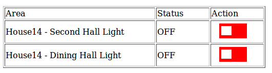

# PI_HT12D-E_IOT_Switch
Control relay through webpage by using Raspberry Pi and HT12D and HT12E

Device: Raspberry Pi Model B, HT12D, HT12E, Jumper Wires, Relay

## Wiring

## Instruction
1. Install the required library
   - apache2,apache2-utils,php5, mysql-server  
   - wiringpi - control Pi gpio pin (http://wiringpi.com/)
  
2. Copy the files to /var/www/html/
  
3. Store my_sql.db database to current machine
   - *mysql -u root -p my_db <my_db.sql*

4. create user and grant privilege
   - *mysql -u username -p my_db*
   - *create user username@'ip_address' identified by 'password';*
   - *grant all privileges on my_db.* to username@ip_address identified by 'password';*
   - *flush privileges;*

5. Update the my_db.sql address with correct Pi pin address corrsponding to area id

## Webpage View

Switch:

Switch Automation:

