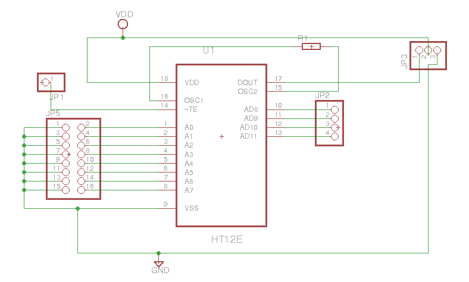

# PI_HT12D-E_IOT_Switch

## Intro
This project is developed so that a switch can be controlled from webpage, thus making it easier to control from any part of the world. 
Rapberry Pi with Raspbian OS is used as the gateway for user to control switch. User can turn on/off a device using the webpage hosted by Pi. The webpage uses sql database for displaying info related to a switch.
  
  In order to eliminate the use of long wires to reach targetted device from the Pi for on/off, Holtek HT12D and HT12E is used. HT12E with XY-MK5V and HT12D with XD-FST acts as a remote control to transmit and receive RF signal (refer HT12D/HT12E documentation). HT12D with specific address is connected with targetted device at particular data output. Each address can drive 4 data output (Refer Wiring section). HT12E which is wired to the Pi, send the received signal from the webpage to the targetted device using the address. The info about the targetted device , its corresponding address and data line is stored in the sql database. For controlling the targetted device for automation based on time, cronjob is utilised.
  
 The HT12E and HT12D are supplied with 5V voltage. Targetted frequncy(fEnc) HT12E is 3KHz. Hence, 1MOhm resistor is used based on the HT12E datasheet. As for HT12D, targetted frequency is 50*fEnC=150KHz, thus 51KOhm resisor is used. 

 

Parts: Raspberry Pi Model B, HT12D, HT12E,  XY-MK5V, XD-FST

## Wiring
#### HT12D

#### HT12E

## Instruction
1. Install the required library
   - apache2,apache2-utils,php5, mysql-server  
   - wiringpi - control Pi gpio pin (http://wiringpi.com/)
  
2. Copy the files from web to /var/www/html/
  
3. Store my_sql.db database to current machine
   - *mysql -u root -p my_db <my_db.sql*

4. Create user and grant privilege
   - *mysql -u username -p my_db*
   - *create user username@'ip_address' identified by 'password';*
   - *grant all privileges on my_db.* to username@ip_address identified by 'password';*
   - *flush privileges;*

5. Update the my_db.sql address with correct Pi pin address corresponding to area id

6. Update the *user* and *pwd* in *auto_switch.sh* and *access_sql.sh* as created in #4

7. Using browser,enter the IP address of the Pi hosting the webpage 
    *make sure the Pi IP address is  included in router port forwarding if accessing the page from external network (not local network)
   
 8. Incase no electricity and want to reinitalize the switch after power up
      either add *\<path\>/reboot access_sql.sh* in crontab -e OR
      add *\<path\>/access_sql.sh* in /etc/rc.local

* For automation, cron is used. For viewing the cronlist
    *crontab -u www-data -l*

## Webpage View

Switch:

Switch Automation:

